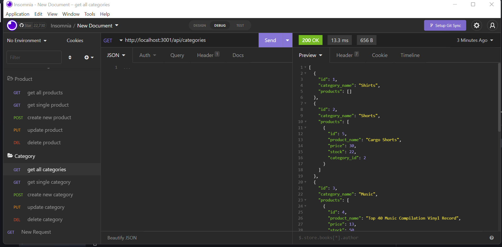

# Mayfield E-commerce BackEnd 

This repo houses the code used to build the Mayfield E-commerce BackEnd.

## The Generator

The Mayfield Employee Tracker is a command-line app that creates and manages an employee database.

## Tools

* The app was built and developed using Visual Studio Code (VS Code). 
* MySQL was used to create and manipulate the database. 
* Node.js was used to code the app/db logic.
* Express.js was used to create a server and connect it to our database.
* Insomnia was used to test api routes.
* Github hosts the repository and published the website.

## Installation

Clone the github repo to your computer. Then, initiate npm by typing ***npm init -y*** in the terminal and pressing enter. Once npm is initiated, install MySQL by typing ***npm install --save mysql2*** and pressing enter.

## Usage

See full-length demo at [https://watch.screencastify.com/v/NPkroTPPWRk4nwg3QRuT](https://watch.screencastify.com/v/NPkroTPPWRk4nwg3QRuT) .

## Credits

Made with ❤️ by Melissa Mayfield

